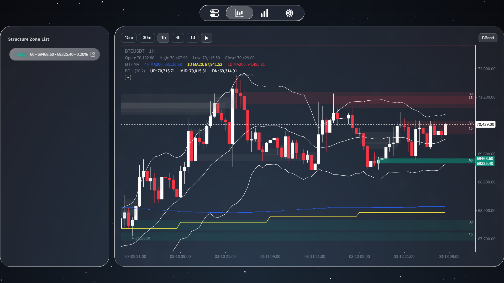
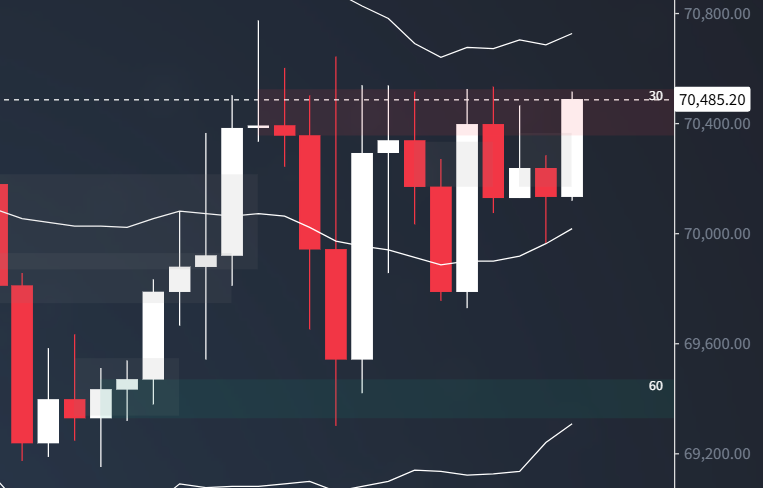
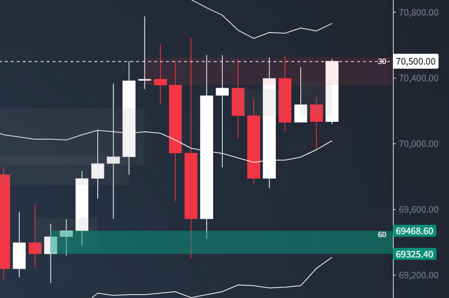
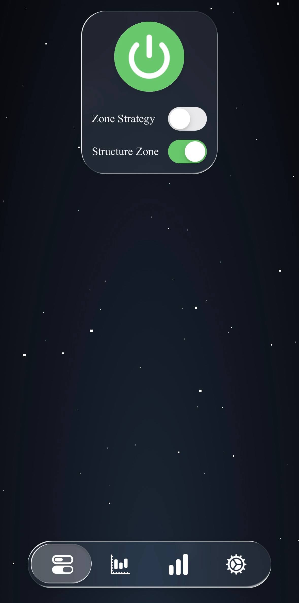
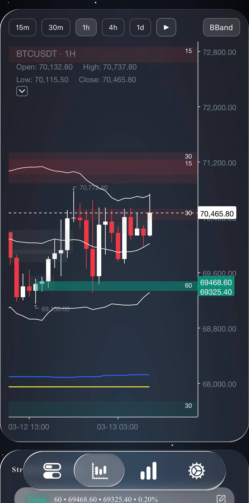
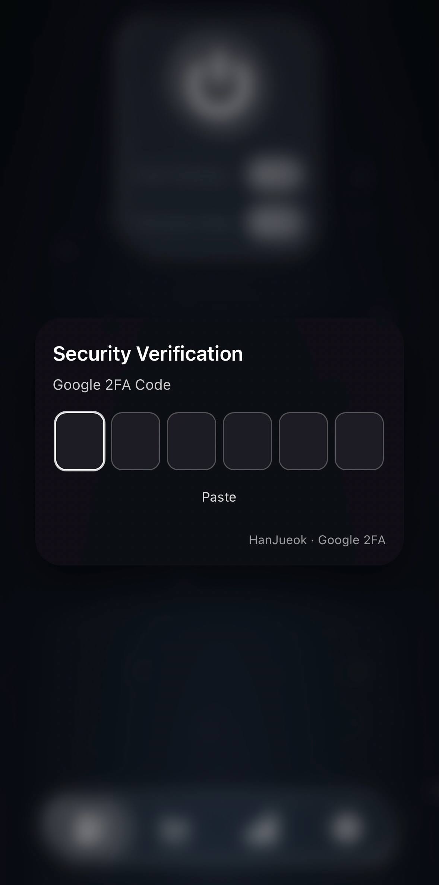
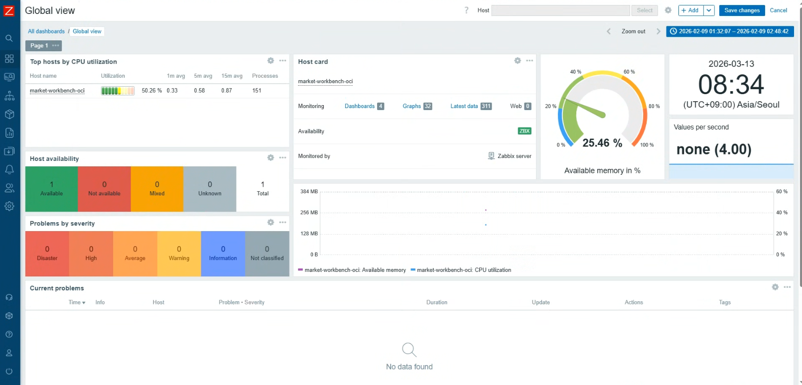
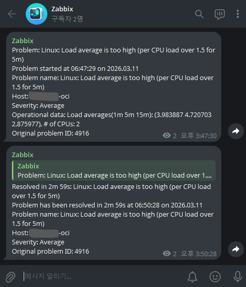
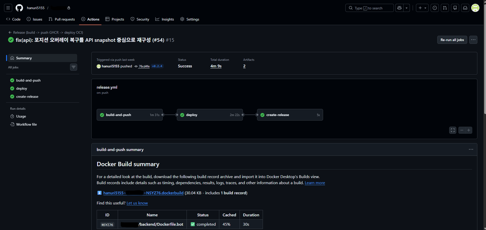

# Market Workbench

차트 오버레이와 토글 인터랙션으로 ICT 기반 진입 후보를 다루는 트레이딩 보조 웹앱.

프로젝트 핵심:

- FastAPI API 서버와 비동기 bot 프로세스 분리 구조
- Docker / Compose 기반 배포 구조
- OCI / GHCR 중심 릴리스 운영 방식
- MySQL 영속화와 WebSocket 동기화 경로
- 초기 REST 로드 + rate-limited WS push + reconnect resync 조합의 MTF MA 동기화 구조
- Bybit V5 WS/REST 기준 거래소 연동 구조
- OTP 게이트, 운영 UI, 모니터링 연결 지점
- ICT 관점 조건이 겹치는 진입 후보를 zone 오버레이로 표시하는 구조
- PC/모바일에서 zone 오버레이 터치/클릭 토글로 매매 판단을 보조하는 흐름

이 저장소 범위:

- 이 저장소에는 차트 오버레이, 토글 인터랙션, 운영 구조 중심 내용을 정리
- 실전 전략 로직과 세부 진입 조건은 별도 비공개 구성에서 관리
- 공개 저장소는 현재 구조와 흐름 설명 중심
- 운영 시크릿과 실배포 환경 구성은 현재 저장소 범위 밖

## 스크린샷

### 1. 차트 메인 화면

- `01-chart-overview-desktop.png`
  데스크탑 기준 메인 차트 화면
  캔들, 이평선, 볼린저 밴드, zone 리스트, zone 오버레이가 한 화면에 모인 상태

### 2. zone 오버레이 디테일

- `02-zone-overlay-closeup.png`
  차트 위에 겹쳐진 zone 영역과 가격 레벨 표시를 확대해서 보여주는 화면
- `03-zone-toggle.png`
  zone 활성 상태가 차트에 반영되는 예시 화면

  
  

### 3. 운영 제어 화면

- `control-center-mobile.jpg`
  모바일 운영 화면
  현재 전략별 on/off 버튼 구성을 모바일 터치 UI 기준으로 보여주는 화면

### 4. 모바일 차트와 접근 흐름

- `10-chart-overview-mobile.jpg`
  모바일에서 차트 오버레이와 하단 네비게이션이 함께 보이는 화면
- `05-otp-gate-mobile.png`
  모바일 OTP 게이트 화면
  운영 화면 접근 전 인증 단계를 보여주는 화면

  
  

### 5. 모니터링과 배포 흐름

- `06-zabbix-monitoring.png`
  OCI 운영 상태를 대시보드에서 확인하는 화면
- `07-zabbix-telegram-alert-cpu-load-average-is-too-high.png`
  장애나 부하 이벤트가 Telegram 알림으로 연결되는 화면
  `(실제 프로젝트 이름과 도메인에 공통으로 쓰는 식별 문자열은 마스킹 처리)`
- `08-github-actions-flow.png`
  GitHub Actions에서 build -> deploy -> release 순서로 이어지는 배포 흐름 화면
  `(실제 프로젝트 이름과 도메인에 공통으로 쓰는 식별 문자열은 마스킹 처리)`

  
  

## 문서

- [아키텍처](docs/ARCHITECTURE.md)
- [백엔드 구조](docs/BACKEND_STRUCTURE.md)
- [배포 구조 메모](docs/DEPLOYMENT.md)
- [PR 작업 흐름](docs/PR_WORKFLOW.md)
- [Zabbix 운영 메모](docs/Zabbix_Agent2.md)
