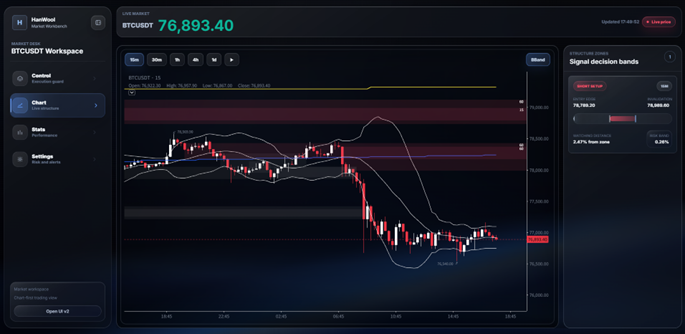
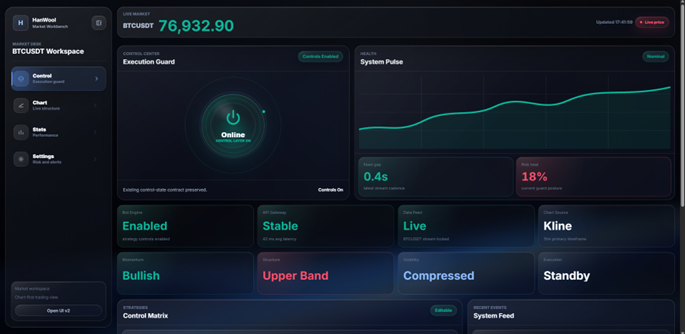
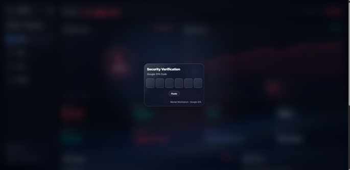
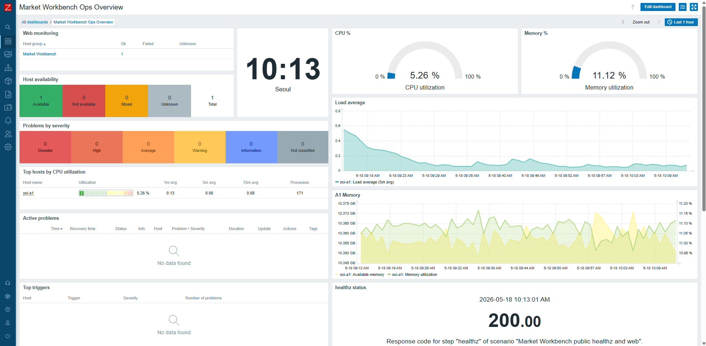
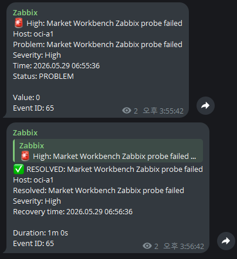
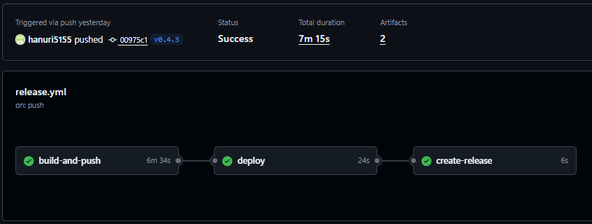

# Market Workbench

> Private trading system을 public portfolio snapshot으로 재구성한 저장소. 최신 공개 반영 기준: 2026-06-23 active chart pipeline, WebSocket 2000 soak summary, Structure Zone 연구 공개 요약, public-safe research validation helper.

Market Workbench는 개인 트레이딩 운영을 위해 만든 **시장 데이터 수집, FastAPI API 서버, 비동기 bot 런타임, React 운영 대시보드, GHCR/OCI 배포, Zabbix 관측 구조**를 공개 범위로 재구성한 프로젝트다.

이 저장소의 목적은 수익 전략을 공개하는 것이 아니라, 백엔드와 인프라 관점에서 **프로세스 경계, 이벤트 흐름, 데이터 정합성 처리, 배포/관측 방식**을 읽을 수 있게 만드는 것이다. 전략 연구 파트는 연구 절차와 검증 경계를 중심으로 정리하고, 실전 전략 규칙과 파라미터는 포함하지 않는다.

## 화면

운영 UI는 제어센터, 실시간 차트, OTP 인증 흐름 중심으로 공개한다. Stats 영역은 공개판에서 아직 mock 데이터다.



<p align="center">
  
  
</p>

## 구조 요약

```text
React UI v3
  -> OTP Gate, Chart Workspace, Structure Zone deck
  -> FastAPI REST/WS
       -> MySQL, in-memory WS state, session/auth boundary
       -> NATS JetStream active gateway
       -> chart-storage durable final/reconcile writer
            <- chart ingest publisher
            <- async bot runtime
                 -> Bybit WS/REST, candles, positions, notifications

운영 계층
  -> Docker Compose
  -> GHCR multi-arch image release
  -> OCI self-hosted runner deploy
  -> /healthz + heartbeat + event loop watchdog
  -> Zabbix + Telegram alert
```

## 공개 스냅샷 핵심 범위

| 영역 | 상태 | 설명 |
| --- | --- | --- |
| OTP 접근 제어 | 연결됨 | Google TOTP 검증, HttpOnly 세션 쿠키, 실패 횟수 제한 |
| UI v3 workspace | 연결됨 | Control/Chart/OTP 흐름 중심. Stats는 공개판에서 mock 데이터 |
| Chart candle WS | 연결됨 | `/ws/chart-candles`, REST 확정봉 보정 event, active gateway fanout |
| Chart active gateway | 연결됨 | NATS JetStream partial/critical event를 `/ws/chart-candles`로 fanout |
| Chart durable storage | 연결됨 | `chart-storage` worker가 final/reconcile event를 MySQL `candles`에 저장 |
| API WS metrics | 연결됨 | local-only `/internal/chart-websocket-metrics`, active/closing send failure 분리 |
| Structure Zone | 연결됨 | DB 상태, REST snapshot, `/ws/zones` delta/state sync |
| Position overlay | 연결됨 | 포지션 조회 fallback, Entry/SL/TP 오버레이, TP/SL 수정 API |
| Strategy research workflow | 확장 | label, cohort, MFE/MAE, leakage guard, source provider, bounded rerun 중심의 공개 가능한 연구 절차 |
| Public research validation helper | 연결됨 | raw 후보 row를 내보내지 않는 aggregate-only summary 예제와 leakage guard 테스트 |
| NATS JetStream | active + shadow | active fanout/durable write 경로와 compare/log/metric 경로 |
| Redis | rollback only | durable path가 아니라 `redis-rollback` profile로만 보존 |
| API-only deploy | 연결됨 | API 이미지만 GHCR에 publish하는 수동 workflow. 운영 rollout은 별도 |
| 배포/운영 | 문서화 | GHCR multi-arch, self-hosted runner deploy, Compose, Zabbix 관측, Locust WS load-test |

## 2026-06-23 공개 반영

- `/ws/chart-candles` gateway는 active/closing send failure split과 close-like control response 처리를 포함한다.
- NATS `chart_ingest_active` event를 API active gateway가 browser WS로 fanout하고, `chart-storage` worker가 final/reconcile event를 MySQL에 저장하는 구조를 공개 범위로 정리했다.
- API-only image publish workflow를 추가했다. API image만 GHCR에 올리고, 운영 rollout은 별도 작업으로 분리한다.
- `backend/core/tools/backfill_candles.py`에 1분봉 plan/dry-run 중심 backfill 경로를 공개 가능한 형태로 포함했다.
- 운영 evidence는 공개하지 않고, 2000 total WebSockets 60분 soak까지의 공개 가능한 판단만 요약했다.
- Structure Zone 연구는 q4, no-entry, post-formation pre-entry, MA regime, short compression, external official source 검증 축으로 공개 요약을 갱신했다.
- `backend/core/research/public_validation_summary.py`를 추가해 source provider / bounded summary / leakage guard 책임을 작은 공개용 코드로 보여준다. 이 코드는 실전 전략 조건을 포함하지 않고, candidate id와 raw row를 output에 남기지 않는다.

## 전략 연구 방식

공개 레포에서는 실제 전략의 생성 규칙이나 threshold를 공개하지 않는다. 대신 후보 구간을 어떻게 연구하는지, 결과 label을 어떻게 붙이는지, 미래 정보가 feature에 섞이지 않도록 어떤 guard를 두는지, source provider가 어떤 품질 정보를 남기는지, 그리고 어떤 검증을 통과해야 다음 단계로 넘어가는지를 설명한다.

연구 문서에서는 q4, 관찰 가설 버전, MFE/MAE, no-entry, MA regime 같은 연구 용어를 먼저 풀어 설명한 뒤 실제 전략 규칙과 분리해서 다룬다. 핵심은 특정 조건을 공개하는 것이 아니라, 후보를 어떻게 정의하고 검증했는지의 흐름을 보여주는 데 있다.

자세한 내용은 [전략 연구 방식](docs/STRATEGY_RESEARCH_WORKFLOW.md)과 [Structure Zone 연구 공개 요약](docs/research/structure-zone-research-public-20260623.md)에 정리했다.

## 기술 스택

- Backend: Python, FastAPI, SQLAlchemy, MySQL, asyncio, WebSocket
- Runtime: Bybit REST/WS, NATS chart event fanout, JSON runtime store
- Broker/runtime: NATS JetStream, active gateway, durable consumer, explicit ack, replay/pending 관찰
- Frontend: React, Vite, klinecharts, custom UI v3 workspace
- Operations: Docker, Docker Compose, GHCR, GitHub Actions, OCI, Zabbix Agent2
- Security: Google OTP, HttpOnly cookie session, middleware allowlist

## 실행

프론트엔드는 공개 레포만으로 빌드 확인이 가능하다.

```bash
cd frontend
npm install
npm run build
```

API/BOT 실행은 MySQL, `deploy/.env.example` 기반 환경변수, 운영용 `backend/config/config.json`이 필요하다. 공개 레포에는 실운영 키, 로그, config, storage 산출물을 포함하지 않는다. 공개 예시 설정은 live order placement가 꺼진 상태를 기본값으로 둔다.

## 운영 포인트

- API/BOT 프로세스 분리로 브라우저 요청과 거래소 이벤트 처리를 분리
- NATS active gateway와 WS fanout 분리로 ingest, API, browser push 경계 명확화
- MySQL canonical state와 projection/read path 분리로 차트 최초 진입 비용 축소
- NATS JetStream active/shadow consumer로 consumer recovery, pending, redelivery 관찰
- Redis는 durable broker가 아니라 rollback profile로 격리
- `/healthz`, bot heartbeat, event loop watchdog, Zabbix, Telegram을 조합해 내부/외부 관측 분리
- API-only publish와 full release를 분리해 API hotfix/backfill tool 검증 범위를 좁힘
- 태그 기반 GHCR build -> self-hosted runner compose pull/up으로 운영 서버 빌드 편차 축소

## 스크린샷 기록

### 모니터링과 장애 감지



<p align="center">
  
</p>

### 배포와 릴리스 흐름

릴리스는 태그 push를 기준으로 실행된다. GitHub-hosted runner는 API/BOT 이미지를 GHCR에 multi-arch로 push하고, self-hosted runner가 운영 compose host에서 API health check 후 BOT을 재기동한다. API-only publish는 별도 수동 workflow로 분리한다.

| 단계 | 실행 위치 | 역할 |
| --- | --- | --- |
| 1. tag push | GitHub Actions | `v*` 태그 push가 release workflow를 시작 |
| 2. build-and-push | GitHub-hosted runner | API/BOT 이미지를 `linux/amd64`, `linux/arm64`로 빌드하고 GHCR에 push |
| 3. deploy | self-hosted runner | compose host에서 이미지 태그 갱신 후 API, BOT을 순서대로 `--no-deps` 재기동 |
| 4. verify/release | compose host + GitHub | `/healthz`, `docker compose ps` 확인 후 draft GitHub Release 생성 |

<p align="center">
  
</p>

## 관련 문서

- [아키텍처](docs/ARCHITECTURE.md)
- [백엔드 구조](docs/BACKEND_STRUCTURE.md)
- [UI v3 정리](docs/UI_V3_PREVIEW.md)
- [Chart event contract](docs/CHART_EVENT_CONTRACT.md)
- [Chart ingest broker design](docs/CHART_INGEST_BROKER_DESIGN.md)
- [배포 구조](docs/DEPLOYMENT.md)
- [배포 workflow 정책](docs/ops/deploy-workflow-policy.md)
- [NATS shadow subscribe 검증 요약](docs/ops/nats-shadow-subscribe.md)
- [WebSocket load-test / metrics 요약](docs/ops/websocket-loadtest-capacity-public-20260531.md)
- [GHCR ARM64 체크리스트](docs/ops/ghcr-multiarch-arm64-checklist.md)
- [Zabbix 기반 원격 모니터링](docs/Zabbix_Agent2.md)
- [차트 성능 개선 사례](docs/CHART_PERFORMANCE_CASE_STUDY_PUBLIC.md)
- [전략 연구 방식](docs/STRATEGY_RESEARCH_WORKFLOW.md)
- [Structure Zone 연구 공개 요약](docs/research/structure-zone-research-public-20260623.md)
- [PR 작업 흐름](docs/PR_WORKFLOW.md)

## 공개 범위

- 공개 저장소: 아키텍처, 배포 구조, 운영 흐름, 모니터링 방식, 보안 구조, UI 흐름, demo strategy, 전략 연구 절차
- 비공개 원본: 실전 전략 세부 규칙, 주문 파라미터, 민감 설정, raw 운영 로그, 실제 키, 실제 연구 수치와 조건식
- 원칙: 보여줄 것은 운영 구조로 재구성하고, 보호할 것은 비공개 원본에 남긴다.
